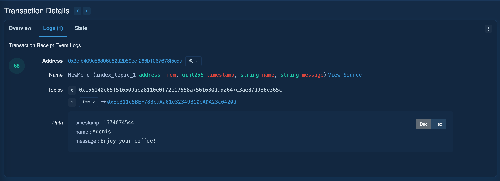

# BuyMeACoffee with Hardhat and Solidity


This is a decentralized application (DApp) built with [Hardhat](https://hardhat.org/) and [Solidity](https://solidity.readthedocs.io/). It is deployed on the [Goerli testnet](https://goerli.net/) and uses [Alchemy](https://alchemyapi.io/) as its node, as well as the Alchemy API for interacting with the Ethereum network.

[Demo Version (Work on Goerli testnet)](https://buymeacoffee-solidity-defi-tipping-app.chefleo.repl.co/)

[Front end code](https://replit.com/@chefleo/BuyMeACoffee-Solidity-DeFi-Tipping-app)

Contract Address -> [0x3eFb409C56306b82d2B59eef266B1067678f5CdA](https://goerli.etherscan.io/address/0x3eFb409C56306b82d2B59eef266B1067678f5CdA)

## Prerequisites

To use this project, you will need to install:

- [Node.js](https://nodejs.org/)
- [Hardhat](https://hardhat.org/install/)

## Installation

To install this project:

1. Clone the repository:

```bash
git clone https://github.com/your-username/hardhat-solidity-project.git
```

2. Go to the project directory:

```bash
cd hardhat-solidity-project
```

3. Install the project dependencies:

```bash
npm install
```

## Usage

To use this project, you need an Alchemy API key. You can get a key by signing up for a free account at https://alchemyapi.io/.

Once you have your API key, create a file called `.env` in the root of the project and add the following lines, replacing `YOUR_API_KEY` with your actual API key and `YOUR_GOERLI_URL` with the Goerli URL provided by Alchemy and `YOUR_PRIVATE_KEY` with the private key for your Metamask account:

```bash
GOERLI_URL=YOUR_GOERLI_URL
GOERLI_API_KEY=GOERLI_API_KEY
PRIVATE_KEY=PRIVATE_KEY
```

With the API key in place, you can use these Hardhat commands to compile, deploy, and interact with the DApp:

- Compile the Solidity contracts:

```bash
npx hardhat compile
```

- Deploy the contracts to the Goerli testnet:

```bash
npx hardhat run scripts/deploy.js --network goerli
```

- Run the Hardhat console, which lets you interact with the deployed contracts:

```bash
npx hardhat console --network goerli
```

- Verify the contract:

```bash
npx hardhat verify --network goerli <YOUR-CONTRACT-ADDRESS>
```

## Explanation BuyMeACoffee Smart Contract

This smart contract allows users to send ether (ETH) to the contract, along with a `name` and `message`. The contract is named `BuyMeACoffee` and is written in the Solidity programming language for the Ethereum blockchain.

## Features

- Emits an event `NewMemo` when a user buys a coffee, which includes information about the transaction (from address, timestamp, name, and message)

```solidity
event NewMemo(
    address indexed from,
    uint256 timestamp,
    string name,
    string message
  );
```

```solidity
function buyCoffee(
    string memory _name,
    string memory _message
  ) public payable {
    require(msg.value > 0, "Can't buy coffee with 0 eth");

    memos.push(Memo(msg.sender, block.timestamp, _name, _message));

    // Emit a log event when a new memo is created
    emit NewMemo(msg.sender, block.timestamp, _name, _message);
  }
```



- Stores an array of `Memos` that are received from users

```solidity
Memo[] memos;
```

- Has a variable `owner` that stores the address of the contract deployer

```solidity
// Address of contract deployer
  address payable owner;

// Deploy logic
constructor() {
  owner = payable(msg.sender);
  }
```

- Allows the `contract owner` to withdraw all the ether that is stored in the contract

```solidity
function withdrawTips() public {
  require(owner.send(address(this).balance));
}
```

- Allows anyone to retrieve all the memos stored in the contract.

```solidity
function getMemos() public view returns (Memo[] memory) {
  return memos;
}
```

## Structs

- **Memo**:
  - `from`: address of the user who sent the transaction
  - `timestamp`: timestamp of the transaction
  - `name`: name of the user who sent the transaction
  - `message`: message sent by the user

## Functions

### buyCoffee

This function allows a user to send ether to the contract and stores their name and message as a `Memo` in the contract.

**Input**

- _name: name of the user sending the transaction
- _message: message sent by the user

### withdrawTips

This function allows the contract owner to withdraw all the ether that is stored in the contract.

### getMemos

This function allows anyone to retrieve all the memos stored in the contract.

**Output**

- Memo[] : array of memos stored in the contract

## Deployment

The address of the contract deployer is assigned to the `owner` variable upon deployment.

## Note

This smart contract is shared under `UNLICENSED license`. It is intended for educational and informational purposes only, and is not a recommendation or endorsement of any particular smart contract. Use caution when interacting with any smart contract, as they can be complex and potentially unsafe.

## The video where i studied

[https://www.youtube.com/watch?v=cxxKdJk55Lk&list=PLMj8NvODurfEYLsuiClgikZBGDfhwdcXF&index=2&ab_channel=Alchemy](https://www.youtube.com/watch?v=cxxKdJk55Lk&list=PLMj8NvODurfEYLsuiClgikZBGDfhwdcXF&index=2&ab_channel=Alchemy)
