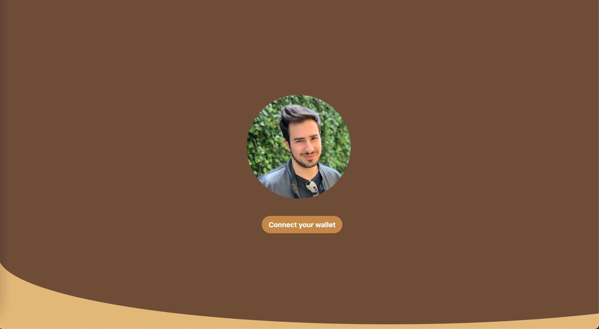

# BuyMeACoffee with Hardhat and Solidity



This is a decentralized application (DApp) built with [Hardhat](https://hardhat.org/) and [Solidity](https://solidity.readthedocs.io/). It is deployed on the [Goerli testnet](https://goerli.net/) and uses [Alchemy](https://alchemyapi.io/) as its node, as well as the Alchemy API for interacting with the Ethereum network.

## Prerequisites

To use this project, you will need to install:

- [Node.js](https://nodejs.org/)
- [Hardhat](https://hardhat.org/install/)

## Installation

To install this project:

1. Clone the repository:

```bash
git clone https://github.com/your-username/hardhat-solidity-project.git
```

2. Go to the project directory:

```bash
cd hardhat-solidity-project
```

3. Install the project dependencies:

```bash
npm install
```

## Usage

To use this project, you need an Alchemy API key. You can get a key by signing up for a free account at https://alchemyapi.io/.

Once you have your API key, create a file called `.env` in the root of the project and add the following lines, replacing `YOUR_API_KEY` with your actual API key and `YOUR_GOERLI_URL` with the Goerli URL provided by Alchemy and `YOUR_PRIVATE_KEY` with the private key for your Metamask account:

```bash
GOERLI_URL=YOUR_GOERLI_URL
GOERLI_API_KEY=GOERLI_API_KEY
PRIVATE_KEY=PRIVATE_KEY
```

With the API key in place, you can use these Hardhat commands to compile, deploy, and interact with the DApp:

- Compile the Solidity contracts:

```bash
npx hardhat compile
```

- Deploy the contracts to the Goerli testnet:

```bash
npx hardhat run scripts/deploy.js --network goerli
```

- Run the Hardhat console, which lets you interact with the deployed contracts:

```bash
npx hardhat console --network goerli
```

## The video where i studied
[https://www.youtube.com/watch?v=cxxKdJk55Lk&list=PLMj8NvODurfEYLsuiClgikZBGDfhwdcXF&index=2&ab_channel=Alchemy](https://www.youtube.com/watch?v=cxxKdJk55Lk&list=PLMj8NvODurfEYLsuiClgikZBGDfhwdcXF&index=2&ab_channel=Alchemy)

